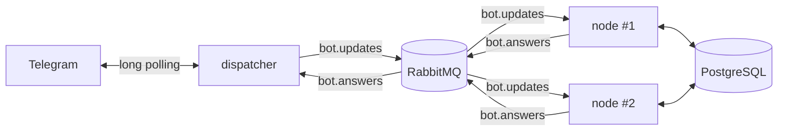

# Speaking Club Bot

[](https://github.com/Mkilord/speaking-club-bot/actions/workflows/ci.yml)

Telegram-бот для разговорных клубов. Участники подписываются на клубы и записываются на встречи, организаторы создают и публикуют встречи, модераторы управляют клубами и сотрудниками.

Бот состоит из двух сервисов, которые общаются через RabbitMQ. Сервис с бизнес-логикой можно запускать в нескольких экземплярах: состояние диалогов хранится в PostgreSQL, а не в памяти процесса.

## Возможности

- Регистрация с проверкой ФИО, телефона и email, редактирование и удаление профиля.
- Клубы: подписка на уведомления, описание, рейтинг по оценкам участников (одна оценка от пользователя, повторная заменяет старую).
- Встречи: создание, публикация с рассылкой подписчикам, запись и отмена записи, список участников, отметка о проведении, отмена с уведомлением участников и подписчиков.
- Роли `USER`, `MEMBER`, `ORGANIZER`, `MODERATOR`. Команда `/help` показывает только доступные роли команды.
- Многошаговые диалоги с текстовым вводом и inline-кнопками. Кнопка из старого сообщения не срабатывает в новом диалоге.

## Архитектура



- `dispatcher` получает апдейты от Telegram, сразу отвечает на нажатия кнопок и публикует текстовые сообщения и callback-и в очередь `bot.updates`. Ответы из очереди `bot.answers` отправляет в Telegram.
- `node` обрабатывает апдейты: ведёт диалог, работает с базой, публикует ответы.
- `common` содержит общую топологию RabbitMQ, которую объявляют оба сервиса.

### Как node обрабатывает апдейт

Каждый апдейт обрабатывается в одной транзакции:

1. `update_id` записывается в таблицу `processed_update`. Если он там уже есть, апдейт пропускается. Так повторная доставка из RabbitMQ не применяется дважды.
2. Строка `dialog_state` чата блокируется через `SELECT ... FOR UPDATE`. Апдейты одного чата обрабатываются по одному, даже если пришли в разные реплики. Разные чаты друг другу не мешают.
3. Движок диалогов (`node/.../fsm`) выполняет шаг команды и сохраняет новое состояние.
4. Ответы копятся в контексте и публикуются после коммита.

Если обработка падает, сообщение повторяется (3 попытки с растущей задержкой), затем уходит в `bot.updates.dlq`. Диалог пользователя сбрасывается, и ему приходит сообщение об ошибке. У `dispatcher` так же: ответ, который Telegram не принял из-за лимита (429) или ошибки сервера, повторяется и в конце попадает в `bot.answers.dlq`. Ошибки вроде "пользователь заблокировал бота" не повторяются.

Ограничения:

- Порядок апдейтов одного чата не гарантирован строго: два сообщения, отправленные почти одновременно, могут попасть в разные реплики и обработаться в обратном порядке. Каждое при этом применится ровно один раз.
- Если публикация ответа упала уже после коммита, ответ теряется: повторная доставка апдейта будет пропущена как обработанная.

### Движок диалогов

Команда описывается декларативно, как цепочка шагов:

```java
Command.create("/feedback")
        .access(Role.REGISTERED)
        .help("оценить клуб")
        .input(inputs.selectClub(), ratingInput)
        .post(context -> clubService.rate(...))
        .build();
```

Шаг бывает трёх видов (`Input.text`, `Input.menu`, `Input.message`). Меню не хранится между сообщениями: при нажатии кнопки оно строится заново из состояния диалога, поэтому в базе лежат только id текущего шага и строковые значения. Идентификаторы шагов строятся из имени команды и номера шага (`/feedback1`), они одинаковы на всех репликах и после перезапуска.

## Команды бота

| Команда | Кому доступна | Что делает |
|---|---|---|
| `/start`, `/help` | всем | приветствие и список команд |
| `/register` | новым пользователям | регистрация |
| `/profile`, `/edit_profile`, `/delete_account` | зарегистрированным | профиль |
| `/clubs` | зарегистрированным | клубы: запись на встречу, подписка, описание |
| `/meets` | зарегистрированным | мои встречи, отмена записи |
| `/feedback` | зарегистрированным | оценка клуба от 1 до 10 |
| `/create_meeting`, `/control_meeting` | организаторам и модераторам | создание и управление встречами |
| `/create_club`, `/control_clubs` | модераторам | создание, изменение и удаление клубов |
| `/add_employee`, `/control_employees` | модераторам | назначение и снятие организаторов |

Модератором становится пользователь, чей Telegram id указан в `MODERATOR_IDS`, после `/register`. Организаторов назначает модератор по username.

## Стек

Java 21, Spring Boot 3.4, Spring AMQP, Spring Data JPA (Hibernate), Liquibase, PostgreSQL 16, RabbitMQ 3.13, TelegramBots 6.9, JUnit 5, Mockito, Maven, Docker Compose, GitHub Actions.

## Быстрый старт

Нужны Docker и Docker Compose.

1. Создайте бота через [@BotFather](https://t.me/BotFather) и получите токен.
2. Скопируйте пример окружения и заполните его:

    ```bash
    cp .env.example .env
    ```

    | Переменная | Описание |
    |---|---|
    | `BOT_TOKEN`, `BOT_USERNAME` | токен и username бота |
    | `MODERATOR_IDS` | Telegram id модераторов через запятую |
    | `POSTGRES_DB`, `POSTGRES_USER`, `POSTGRES_PASSWORD` | база данных |
    | `RABBIT_USERNAME`, `RABBIT_PASSWORD` | RabbitMQ |
    | `NODE_REPLICAS` | сколько экземпляров node запустить, по умолчанию 2 |
    | `BOT_TIME_ZONE` | часовой пояс клуба, по умолчанию `Europe/Moscow` |

3. Запустите:

    ```bash
    docker compose up -d --build
    ```

    Сначала сервис `migrate` применяет миграции Liquibase и завершается, после этого стартуют реплики `node`.

4. Напишите боту `/start`.

Логи: `docker compose logs -f dispatcher node`. Панель RabbitMQ: http://localhost:15672.

## Локальная разработка

Сборка и тесты:

```bash
mvn verify
```

Для запуска из IDE поднимите инфраструктуру и запустите `DispatcherApplication` и `NodeApplication`:

```bash
docker compose up -d postgres rabbitmq
```

В этом случае пробросьте порт Postgres наружу (в `docker-compose.yml` он закрыт) или запустите PostgreSQL отдельно. Настройки по умолчанию лежат в `application.yaml` каждого сервиса и переопределяются переменными окружения: `POSTGRES_URL`, `RABBIT_HOST`, `RABBIT_PORT`, `BOT_TOKEN` и другими.

Оба сервиса отдают состояние на `/actuator/health`: `dispatcher` на порту 8081, `node` на 8082.

## Структура проекта

```text
common/       общая топология RabbitMQ: очереди, DLQ, JSON-конвертер
dispatcher/   связь с Telegram: приём апдейтов, отправка ответов
node/
  fsm/        движок диалогов: Command, Input, Menu, DialogEngine
  command/    команды бота, сгруппированные по ролям
  dialog/     хранение состояния диалогов, идемпотентность, очистка
  messaging/  слушатель апдейтов, публикация ответов, обработка сбоев
  service/    бизнес-логика клубов, встреч и пользователей
  resources/db/changelog/  миграции Liquibase
Dockerfile    многоэтапная сборка обоих образов (--target dispatcher|node)
```
